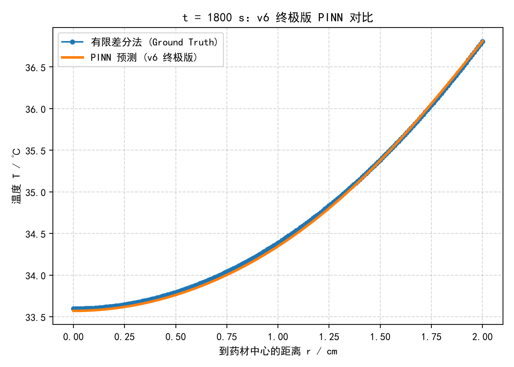

# 药材烘干模型的数值模拟：从数模到北太天元，再到PINN

这是我本科阶段围绕“圆柱形药材热风烘干”做的一些代码和学习记录。内容主要分为三个部分：最初的数模代码、移植到国产软件北太天元的代码，以及最近刚摸索的物理信息神经网络（PINN）。

## 📁 文件夹说明

### 01_Python_Original（数学建模代码）
这是我之前参加数学建模竞赛时写的代码。针对圆柱形药材建立了一维径向的传热传质模型，用隐式差分和追赶法（TDMA）去解这个非稳态偏微分方程。
里面包含网格无关性验证、时间步长收敛性分析，以及二维轴对称模型的交叉校验。`figures` 和 `results` 文件夹里是当时跑出来的图表和结果数据。

### 02_Baltamatica_Classic（北太天元移植代码）
这部分是为了参加北太天元的比赛做的。我把上面的Python代码翻译成了北太天元的M脚本，把竞赛里四个问题都重新写了一遍。因为比赛要求用国产系统，我还在虚拟机里装了银河麒麟（openKylin）系统，在里面装好北太天元跑通了。
*   `solve1.m` ~ `solve4.m`：对应四个问题的求解脚本
*   `common.m`：追赶法的通用函数
*   `plot1234.m`：画图的代码
*   【银河麒麟系统运行演示视频】：[点击这里查看（B站链接）](https://b23.tv/TkpeRWY)

### 03_PINN_Exploration（AI for Science初步尝试）
最近在学 PyTorch，就想试试用物理信息神经网络（PINN）来解我之前那个传热方程。算是一个从传统数值解跨越到 AI for Science 的初步尝试。

> **完整的 PINN 代码（v1-v6 迭代）和对比图，我已经整理在 `code` 和 `figures` 文件夹里。**

**探索过程中的一点踩坑记录：**
最初我把圆柱坐标下的热传导方程直接写进了损失函数（PDE残差）。但跑出来的结果非常惨——网络由于“频谱偏置”直接摆烂，输出了一条没有任何梯度的平线，MSE高达8.66。

后来我尝试加入差分法算出来的数据作为监督。经历了几个阶段：
1. 只给单点数据（t=1800s），网络只是“死记硬背”了答案，画出一条斜直线，泛化能力极差；
2. 给全时空数据，但由于数据权重过高，网络为了迎合数据完全违背了物理方程，学偏了；
3. 调整权重，但简单 MLP 依然无法捕捉空间梯度，整体偏移。

**最终的解决方案：**
我引入了**傅里叶特征（Fourier Features）**对空间坐标进行高维映射，配合重点采样策略和**学习率衰减**，把 PDE 权重和数据权重的比例进行了精细博弈。最终在 v6 版本里，MSE 降到了 **0.000810**，和隐式差分法的结果完美重合。

 

虽然目前 PINN 的计算速度和绝对精度还比不上传统的隐式差分法，但在这次摸索中，我切实体会到了“物理机制”与“数据驱动”平衡的难度与乐趣，也算是正式踏入了 AI4Science 的门槛。

## 🛠️ 环境依赖
* Python部分：numpy, pandas, scipy, matplotlib
* PINN部分：torch
* 北太天元部分：北太天元2025版

## 怎么跑
* Python代码直接运行 `01_Python_Original` 文件夹里的脚本即可。
* 北太天元代码需要用北太天元软件打开 `02_Baltamatica_Classic` 里的 `.m` 文件，工作路径设置对。
* PINN代码在 `03_PINN_Exploration` 里，安装好 torch 后直接运行 `pinn_v6_final.py` 即可看到对比图。